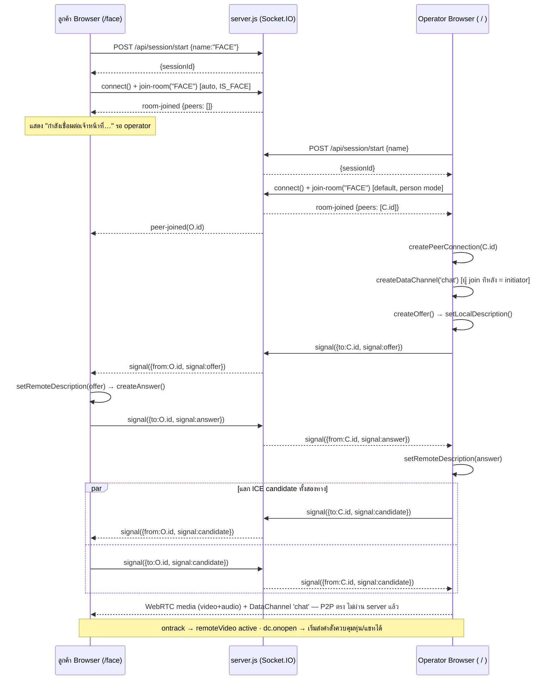
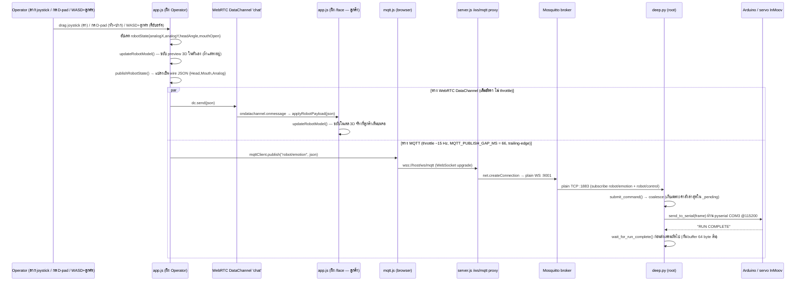
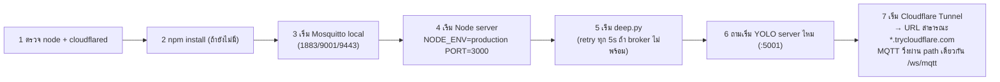

# Dataflow Diagram — Avatar Robot VideoCall

> อ้างอิงจากโค้ดจริงใน `videocall/` (โค้ดที่รันจริงผ่าน `start-local.bat`) ตรวจสอบทีละบรรทัดในไฟล์ `videocall/server.js`, `videocall/public/app.js`, `videocall/public/index.html`, root `deep.py`, `yolo_server.py`, `mosquitto/mosquitto-local.conf`, `start-local.bat` ณ วันที่ 21 กรกฎาคม 2569
>
> ⚠️ **แทนที่ `Dataflow_diagram.png` เดิม (10 ก.ค.)** — ไฟล์เดิมไม่ครอบคลุมโหมด AI Chat, YOLO detection, ฟีเจอร์ accessibility, การรวมแท็บ Robot เข้ากับ Person, และ command-coalescing ของ `deep.py` เวอร์ชันล่าสุด
>
> ⚠️ **มีโค้ดสองชุดในโปรเจกต์เดียว** — `videocall/` คือโค้ดที่พัฒนาและรันจริง (`start-local.bat` เรียกจากที่นี่) ส่วน `server.js`/`public/` ที่ root คือสำเนาเก่ากว่า ~1 เดือน ใช้เป็น Docker/Railway build context เท่านั้น เอกสารนี้อ้างอิง **`videocall/` เท่านั้น**

---

## 1. ภาพรวมระบบ (System Architecture)

```mermaid
flowchart TB
    subgraph OP["🖥️ Operator Browser  ( / )"]
        OPUI["index.html + app.js<br/>โหมด person (default) · ai (ซ่อนใน Settings)"]
    end

    subgraph FACE["📺 /face — จอ/กล้องหน้าหุ่น (ลูกค้า)"]
        FACEUI["index.html + app.js<br/>โหมด robot (บังคับ, auto-login \"FACE\")"]
    end

    subgraph SRV["🟩 Node.js — videocall/server.js"]
        EXPRESS["Express<br/>static files + REST API"]
        SIO["Socket.IO<br/>signaling + chat relay"]
        PROXY["/ws/mqtt<br/>raw TCP→WS proxy"]
    end

    DB[("🗄️ SQLite\nvideocall.db\n(sessions log)")]

    subgraph MQ["🦟 Mosquitto — LAN broker (mosquitto-local.conf)"]
        MQTT["1883 TCP · 9001 WS · 9443 WSS\ntopics: robot/control, robot/emotion"]
    end

    subgraph BR["🐍 deep.py (root — ตัวที่ใช้งานจริง)"]
        BRW["MQTT subscriber\ncommand-coalescing worker\npyserial writer"]
    end

    HW["🦾 Arduino + หุ่น InMoov\nservo Head / Mouth / Eyes"]
    YOLO["🐍 yolo_server.py : 5001\nYOLOv8n (ultralytics)"]
    AIP["☁️ AI Providers\nGroq · OpenRouter · Gemini · Anthropic · 9Arm"]
    CF["☁️ Cloudflare Tunnel\n*.trycloudflare.com — HTTPS สาธารณะ"]

    OPUI <-. "WebRTC P2P — video + audio + DataChannel 'chat'" .-> FACEUI

    OPUI -- "join-room / signal / chat-message" --> SIO
    FACEUI -- "join-room / signal" --> SIO
    OPUI -- "HTTPS REST" --> EXPRESS
    FACEUI -- "HTTPS REST" --> EXPRESS

    OPUI -. "wss://host/ws/mqtt" .-> PROXY
    FACEUI -. "wss://host/ws/mqtt" .-> PROXY
    PROXY -- "plain WS :9001" --> MQTT

    EXPRESS --> DB
    EXPRESS -- "proxy JPEG frame" --> YOLO
    EXPRESS -- "proxy chat request" --> AIP

    MQTT -- "plain TCP :1883" --> BRW
    BRW -- "Serial USB 115200 baud" --> HW

    CF === EXPRESS
```

**หลักการ:** ไม่มี build step ทั้งฝั่ง frontend (vanilla JS ไฟล์เดียว `app.js` ~2400 บรรทัด โหลด library ผ่าน CDN) และไม่มี database server แยก (SQLite ไฟล์เดียวเก็บแค่ session log) Backend เป็น Node.js + Express ตัวเดียวที่ทำหน้าที่ทั้ง static file server, REST API, Socket.IO signaling hub และ MQTT WebSocket proxy ในโปรเสสเดียว

---

## 2. หน้า/โหมดการทำงาน

SPA เดียว ไม่มี client router — แยกพฤติกรรมด้วย URL path + `state.mode`

| Path | ใครใช้ | โหมดเริ่มต้น | พฤติกรรม |
|---|---|---|---|
| `/` | **Operator** (เจ้าหน้าที่หน้าคอม) | `person` | Login ด้วยชื่อ (ไม่มีรหัสผ่าน) → วิดีโอคอล + แผงควบคุมหุ่น (joystick/D-pad) รวมในแท็บเดียว |
| `/face` | **ลูกค้า** (จอ/กล้องติดหน้าหุ่นยนต์) | `robot` (บังคับ, ไม่มีปุ่มเลือก) | auto-login `"FACE"`, auto-join ห้อง Socket.IO `FACE`, auto-start STT, ซ่อน header/แชท เต็มจอเฉพาะโมเดลหน้า 3D |

`state.mode` มี 3 ค่าภายใน (`'person' | 'ai' | 'robot'`) แต่เมนูโชว์แค่ 2 ปุ่ม — `ai` (คุยกับ AI + YOLO detection) ซ่อนโดย default (`settings.showAiMode = false`) เปิดได้ที่ Settings เพราะโฟกัสหลักของโปรเจกต์คือการสื่อสาร operator ↔ ลูกค้า ไม่ใช่ AI (ตาม [CLAUDE.md](CLAUDE.md)) ส่วน `robot` ไม่มีปุ่มเมนูเลย เป็น state ภายในของ `/face` เท่านั้น

ทั้ง `/` (person mode) และ `/face` auto-join ห้อง Socket.IO/WebRTC ชื่อ `FACE` เป็นค่าเริ่มต้น — เชื่อมกันเองโดยไม่ต้องแลกรหัสห้อง

---

## 3. Sequence: เข้าเว็บ → Login → WebRTC เชื่อมต่อ



ICE servers มาจาก `GET /api/ice-config`: Google STUN ×2 + `openrelay.metered.ca` STUN/TURN ฟรี ×3 + TURN ของผู้ใช้เอง (Settings หรือ env `TURN_URL/TURN_USER/TURN_PASS`) โค้ดจอง audio transceiver (`sendrecv`) ไว้ตั้งแต่สร้าง `RTCPeerConnection` เสมอ เพื่อให้ mute/resume ไมค์ตอน STT ทำผ่าน `replaceTrack()` ได้โดยไม่ต้อง renegotiate SDP (ไม่มี `onnegotiationneeded` handler เลยในโค้ดนี้) `oniceconnectionstatechange` เรียก `pc.restartIce()` อัตโนมัติเมื่อ state เป็น `failed`

---

## 4. Sequence: ควบคุมหุ่นยนต์ (joystick / D-pad / คีย์บอร์ด)



**ทำไมต้องมี 2 เส้นทางคู่ขนาน:** DataChannel ให้ latency ต่ำสุดสำหรับโมเดล 3D preview ฝั่งลูกค้า/operator ส่วน MQTT คือเส้นทางเดียวที่ไปถึงฮาร์ดแวร์จริง (`deep.py` ไม่ได้ต่อ WebRTC) — MQTT ถูก throttle เพราะ joystick ลากได้ 60+ Hz แต่ Arduino execute ทีละคำสั่ง ถ้าไม่ throttle+coalesce จะสะสม backlog ทำให้หุ่นสะดุด/หน่วง เมื่อ DataChannel เปิดอยู่ โค้ดฝั่ง browser จะ**ข้าม**ข้อความ single-frame จาก MQTT loopback ของตัวเอง (เช็คด้วย `isRecentSelfPub`) เพื่อไม่ให้โมเดล 3D กระตุกสลับเฟรมเก่า/ใหม่

---

## 5. Sequence: โหมด AI Chat + YOLO Detection (ซ่อนโดย default)

```mermaid
sequenceDiagram
    participant U as Operator
    participant JS as app.js (โหมด ai)
    participant SRV as server.js
    participant PROV as AI Provider (Groq/OpenRouter/Gemini/Anthropic/9Arm)
    participant YOLO as yolo_server.py : 5001
    participant MQ as MQTT "robot/emotion"

    loop ทุก 400 ms ระหว่างอยู่โหมด ai
        JS->>JS: capture เฟรมจากกล้อง local → JPEG q0.7
        JS->>SRV: POST /api/detect (raw JPEG)
        SRV->>YOLO: POST /detect (proxy ตรงๆ)
        YOLO-->>SRV: [{x1,y1,x2,y2,label,conf}, …]  (กรอง conf ≥ 0.60 ฝั่ง server)
        SRV-->>JS: detections[] (หรือ [] เงียบๆ ถ้า yolo_server ไม่รัน)
        JS->>JS: วาด bounding box สีตาม hash(label) บน &lt;canvas&gt; ทับวิดีโอ
    end

    U->>JS: พิมพ์ หรือพูด (Web Speech / Whisper STT)
    JS->>JS: sendToAI(text) — push aiHistory, showTypingIndicator()
    JS->>SRV: POST /api/ai {provider, model, systemPrompt, messages}
    SRV->>PROV: chat/completions (หรือ REST เฉพาะของแต่ละ provider)
    PROV-->>SRV: reply text (มี JSON {"Head":..,"Mouth":..,"Analog":{...}} ฝังในข้อความ)
    SRV-->>JS: {content}
    JS->>JS: stripJsonBlocks() → appendMessage() แสดงข้อความล้วนในแชท
    JS->>JS: publishEmotion(content) → extractJsonBlocks() → clamp → array
    JS->>MQ: publish "robot/emotion" [frame1, frame2, …]
    JS->>JS: speak(text) — TTS เสียงไทย (speechSynthesis)
```

System prompt เริ่มต้นสั่งให้ AI ตอบเป็นภาษาไทยและฝัง JSON ท่าทางหน้า `{"Head":45,"Mouth":30,"Analog":{"x":0,"y":0}}` ไว้ในทุกคำตอบ เพื่อให้หน้าหุ่นขยับตามอารมณ์ที่ AI ตอบ

---

## 6. REST API ทั้งหมด (`videocall/server.js`)

| Method + Path | รับเข้า | ส่งกลับ | หมายเหตุ |
|---|---|---|---|
| `GET /face` | — | `public/index.html` | SPA เดียวกับ `/`, `app.js` ตรวจจับ pathname แล้ว auto-join เอง |
| `GET /api/provider-defaults` | — | `{provider, model, baseUrl, modelLists, keys}` | บอก frontend ว่า provider/key ไหนตั้งค่าไว้บน server แล้ว |
| `POST /api/stt` | raw audio bytes, header `X-Mime-Type` | `{text}` | Groq Whisper (`whisper-large-v3-turbo`, บังคับ `language:"th"`) |
| `POST /api/ai` | `{provider, baseUrl, apiKey, model, messages, systemPrompt}` | `{content}` | Router ไปยัง Groq / OpenRouter / Gemini / Anthropic / 9Arm / OpenAI-compatible ใดๆ |
| `GET /api/ice-config` | — | `{iceServers[]}` | STUN Google + TURN ฟรี openrelay.metered.ca + TURN เองจาก env |
| `POST /api/session/start` | `{name}` | `{sessionId}` | INSERT แถวใหม่ใน SQLite |
| `POST /api/session/end` | `{sessionId, usageSeconds}` | `{ok:true}` | UPDATE usage_seconds + logout_time |
| `POST /api/session/end-beacon` | `{sessionId, usageSeconds}` | `204` | สำหรับ `navigator.sendBeacon` ตอนปิดแท็บ/สลับแอป |
| `GET /api/sessions` | — | array ≤200 แถวล่าสุด | **ไม่มี auth ป้องกัน** — ใครก็เข้าดูได้ถ้ารู้ URL |
| `POST /api/detect` | raw JPEG | `[{x1,y1,x2,y2,label,conf}]` หรือ `[]` | proxy ไป `yolo_server.py:5001`, คืน `[]` เงียบๆ ถ้า service ไม่รัน |

ตรวจสอบโค้ดจริงแล้ว **ไม่มี** `POST /api/translate` และ `POST /api/stt-correct` แล้ว (เอกสารเก่า `videocall/CLAUDE.md` ยังพูดถึงอยู่แต่ฟีเจอร์ถูกถอดออกจริง)

---

## 7. Socket.IO — Signaling & Chat Relay

Path `/socket.io/`, `cors:{origin:'*'}`, `transports:['websocket','polling']`, `destroyUpgrade:false` (ปล่อยให้ `/ws/mqtt` upgrade ผ่านไปหา MQTT proxy ได้โดยไม่ชนกัน)

| Event (client → server) | payload | server ทำอะไร |
|---|---|---|
| `join-room` | `roomId` | ออกจากห้องเดิมทั้งหมด (broadcast `peer-left`), join ห้องใหม่, ตอบ `room-joined` พร้อมรายชื่อ peer เดิม, broadcast `peer-joined` ให้คนอื่นในห้อง |
| `signal` | `{to, signal}` | relay ตรงไปหา socket id `to` เป็น `{from, signal}` — server ไม่แตะ SDP/ICE เลย |
| `chat-message` | `{roomId, message}` | broadcast ทุกคนในห้อง (ไม่รวมผู้ส่ง) — fallback เมื่อ DataChannel ยังไม่เปิด |
| `peer-tts` | `{roomId, enabled}` | broadcast สถานะเปิด/ปิดเสียงอ่านข้อความให้ peer รู้ |
| `disconnect` | — | broadcast `peer-left` ให้ทุกห้องที่ socket นั้นอยู่ |

---

## 8. MQTT — เส้นทางควบคุมหุ่นจริง

### พอร์ต (`mosquitto/mosquitto-local.conf`, `allow_anonymous true` ทุก listener — ไม่มี auth)

| พอร์ต | โปรโตคอล | ใช้กับ |
|---|---|---|
| `1883` | plain MQTT TCP | `deep.py` (root, LAN client ต่อ Arduino) |
| `9001` | plain WebSocket | `server.js` proxy `/ws/mqtt` — เส้นทางที่ browser ใช้จริงผ่าน Cloudflare Tunnel |
| `9443` | WSS (TLS, self-signed auto-gen) | เชื่อมตรงจาก browser แบบเข้ารหัส บน LAN โดยไม่ผ่าน proxy |

### Topics

| Topic | Publish โดย | Subscribe โดย | เนื้อหา |
|---|---|---|---|
| `robot/control` | (สำรอง — เผื่อ client อื่น publish มา) | browser, `deep.py` | frame เดี่ยว `{Head,Mouth,Analog}` |
| `robot/emotion` | browser (joystick/D-pad throttle ~15Hz **และ** AI emotion sequence) | browser (loopback), `deep.py` | frame เดี่ยว หรือ array ของ frame |

`deep.py` subscribe ทั้งสอง topic เสมอ ส่วน browser (`connectMQTT()`) แยก case ด้วยการเช็คว่า payload string ขึ้นต้นด้วย `[` (array = emotion sequence, เล่นเรียง 800ms/frame) หรือไม่ (object เดี่ยว = live control, ใช้ทันที)

### Wire format (ค่า canonical ปัจจุบันในโค้ด — ยืนยันจาก `app.js` บรรทัด 632-633)

```json
{ "Head": 45, "Mouth": 30, "Analog": { "x": 0.0, "y": 0.0 } }
```

| Field | ช่วงค่า | ความหมาย |
|---|---|---|
| `Head` | 0–90 (กลาง = 45) | องศา servo หันหัว (0 = ซ้ายสุด, 90 = ขวาสุด) |
| `Mouth` | 30–100 | Servo ปาก (30 = หุบ, 100 = อ้า/ยิ้ม) |
| `Analog.x` | -1..1 | ตาซ้าย-ขวา (pan) |
| `Analog.y` | -1..1 | ตาบน-ล่าง (tilt) |

หมายเหตุ: ช่วงองศาการหมุนหัวจาก D-pad/คีย์บอร์ด (`headLimit`) กว้างกว่าในโหมด `person` (±45°) เทียบกับโหมดอื่น (±35°) แต่**การเข้ารหัส/ถอดรหัส wire JSON เป็นค่าเดียวกันทุกโหมด** (ไม่ต่างจาก `person` เหมือนที่เอกสาร `WEB.md` เคยบันทึกไว้ — โค้ดถูกรวมกลับเป็นช่วงเดียวแล้ว)

---

## 9. `deep.py` (root) — สะพานเชื่อม MQTT → Arduino

```
Mosquitto (1883 TCP) → deep.py → pyserial (COM3 @115200) → Arduino → servo หุ่น InMoov
```

| ตัวแปร/ฟังก์ชัน | บทบาท |
|---|---|
| `BROKER` (env `MQTT_BROKER`, default `localhost`) | โฮสต์ broker — override เป็น LAN IP ได้ถ้าเครื่อง deep.py คนละเครื่องกับ Mosquitto |
| `SUB_TOPICS = ["robot/emotion","robot/control"]` | subscribe ทั้งสอง topic |
| `send_to_serial(obj)` | serialize เป็น JSON บรรทัดเดียว เขียนลง serial port |
| `drain_serial()` | อ่านทิ้งข้อความค้างจาก Arduino ก่อนรอ RUN COMPLETE ใหม่ (กัน false-positive) |
| `wait_for_run_complete(timeout, warn)` | บล็อกจนกว่า Arduino ส่ง `"RUN COMPLETE"` หรือ timeout |
| `submit_command(payload_str)` | parse JSON แล้ว **overwrite** ตัวแปร `_pending` ตัวเดียว (ไม่ queue) — คำสั่งเก่าที่ยังไม่ส่งถูกทิ้งถ้ามีคำสั่งใหม่มาซ้อน |
| `serial_worker()` (daemon thread) | loop รอ `_pending_ev` → ส่งเฟรมทีละเฟรมผ่าน `send_to_serial` + รอ `wait_for_run_complete` ระหว่างเฟรม — sequence ที่กำลังเล่นถูกขัดจังหวะได้ทันทีถ้ามีคำสั่งใหม่ (เช่น operator จับ joystick กลางอารมณ์ AI) |
| `on_connect` / `on_message` | MQTT callback มาตรฐาน — `on_message` เรียก `submit_command` เท่านั้น (งานหนักอยู่ใน `serial_worker`) |
| retry loop (บรรทัด 181-188) | เชื่อม broker ไม่ติดจะ retry ทุก 5 วิ ไม่ crash — รองรับกรณี Mosquitto ยังไม่ทันเปิด |

`LIVE_FRAME_TIMEOUT = 1.0s` (ไม่ warn) สำหรับเฟรมเดี่ยวจาก joystick/D-pad, `SEQUENCE_FRAME_TIMEOUT = 30s` (warn ถ้า timeout) สำหรับ AI emotion sequence — เหตุผลของการ rework นี้ (เทียบกับ `videocall/deep.py` เวอร์ชันเก่าที่ใช้ `time.sleep(FRAME_DELAY)` ธรรมดา) คือ Arduino มี serial buffer แค่ 64 byte ถ้ายิงเร็วเกินจะสะสม backlog ทำให้หุ่นสะดุด/เล่นท่าเก่าซ้ำ

⚠️ `videocall/deep.py` เป็นสำเนาเก่ากว่ามาก (ไม่มี coalescing, subscribe topic เดียว) — **ไม่ใช่ตัวที่ `start-local.bat` รัน**

---

## 10. `yolo_server.py` — YOLO Object Detection (:5001, เสริม/ปิดโดย default)

Python `http.server` เปล่า (ไม่ใช้ Flask/Express) รับ `POST /detect` เป็น raw JPEG bytes → decode ด้วย OpenCV → รันโมเดล `yolov8n.pt` (ultralytics) → คืน JSON array ของกล่อง `{x1,y1,x2,y2,conf,label}` เดินเครื่องบน `127.0.0.1:5001` เท่านั้น (ไม่ expose ออก LAN), CORS เปิดกว้างสำหรับ `server.js` มาเรียก ถ้าไม่ได้รัน service นี้ `POST /api/detect` ฝั่ง Node จะ catch error แล้วคืน `[]` เงียบๆ — ไม่กระทบฟีเจอร์อื่น

---

## 11. Frontend — `videocall/public/app.js` (~2400 บรรทัด, vanilla JS ไม่มี framework)

ตารางด้านล่างคือฟังก์ชันทั้งหมดในไฟล์ จัดกลุ่มตามหน้าที่ (ยืนยันชื่อฟังก์ชัน+เลขบรรทัดจากโค้ดจริงวันที่ 21 ก.ค. 2569)

### Session & Login
| ฟังก์ชัน | หน้าที่ |
|---|---|
| `unlockTTS()` | เล่นเสียงเงียบครั้งแรกเพื่อปลดล็อก audio context บน iOS |
| `usageSeconds()` | คำนวณวินาทีที่ใช้งานจาก `Date.now() - sessionStartTime` |
| `doLogin(name)` | `POST /api/session/start`, เก็บ `sessionId`/`sessionStartTime`, เริ่ม timer |
| `endSession()` | หยุด timer, `POST /api/session/end` |
| `startSessionTimer()` | แสดง chip เวลาใช้งาน อัปเดตทุกวินาที รูปแบบ `M:SS` |
| `flushSession()` | `navigator.sendBeacon('/api/session/end-beacon')` — bind กับ `beforeunload`/`pagehide`/`visibilitychange` |
| `initLoginScreen()` | จุดเริ่มระบบ — `/face` auto-login "FACE"; หน้าอื่นรอกรอกฟอร์ม |

### Boot & ICE
| ฟังก์ชัน | หน้าที่ |
|---|---|
| `fetchProviderDefaults()` | ดึง `/api/provider-defaults` ผสานเข้ากับ settings ที่ยังไม่เคย save |
| `initApp()` | เรียกหลัง login: setup ฟอร์ม, event listeners, socket, speech recognition, media, ICE |
| `fetchIceConfig()` | ดึง `GET /api/ice-config` เก็บไว้ใช้ตอนสร้าง `RTCPeerConnection` |
| `buildIceConfig(base)` | เติม TURN server ของผู้ใช้เอง (จาก settings) ต่อท้าย list ที่ได้จาก server |

### Local Media
| ฟังก์ชัน | หน้าที่ |
|---|---|
| `startLocalMedia()` | `getUserMedia({video,audio})`, แสดง error เฉพาะเจาะจงถ้าขอกล้อง/ไมค์ไม่สำเร็จ |
| `toggleMic()` | เปิด/ปิด audio track ของตัวเอง |
| `toggleSpeaker()` | mute/unmute ลำโพง (เกทเสียง TTS ทั้งหมดตาม policy accessibility) |
| `toggleCam()` | เปิด/ปิด video track ของตัวเอง |

### โหมด & YOLO Detection
| ฟังก์ชัน | หน้าที่ |
|---|---|
| `applyAiModeVisibility()` | ซ่อน/แสดงปุ่มโหมด AI ตาม `settings.showAiMode` |
| `applyRemoteRotation()` | ปรับ layout วิดีโอตามพาแนลที่กำลังแสดง |
| `applyDetectButtonVisibility()` | ซ่อน/แสดงปุ่ม "ตรวจจับ" (debug feature) ตาม `settings.showDetectButton` |
| `applyMode(mode)` | สลับ `state.mode` — โชว์/ซ่อน robot panel, video wrap, controls row ต่อโหมด |
| `startDetect()` / `stopDetect()` / `toggleDetect()` | เริ่ม/หยุด loop ตรวจจับวัตถุ |
| `runDetectionLoop()` | capture เฟรม → `POST /api/detect` → วาด bounding box ทุก 400ms |
| `setFaceWaitingVisible(show)` | โชว์/ซ่อนข้อความ "กำลังเชื่อมต่อเจ้าหน้าที่…" บน `/face` |

### หุ่น 3D & การควบคุม
| ฟังก์ชัน | หน้าที่ |
|---|---|
| `updateRobotModel()` | ขับเคลื่อน joint ของโมเดล Three.js URDF ตาม `robotState` |
| `applyRobotPayload(str)` | parse JSON เดี่ยว `{Head,Mouth,Analog}` → อัปเดต `robotState` |
| `playEmotionSequence(str)` | เล่น array ของ frame เรียงกัน ห่างกัน 800ms |
| `connectMQTT()` | เชื่อม `mqtt.js` ไป `wss://host/ws/mqtt`, subscribe `robot/control`+`robot/emotion` |
| `announceMqttChange(connected)` | อ่านออกเสียงสถานะ MQTT เปลี่ยน (accessibility) |
| `liveControlTopic()` | คืน topic ควบคุมสด (default `robot/control`, ตั้งเองได้ที่ Settings) |
| `rememberSelfPub()` / `isRecentSelfPub()` | กัน MQTT loopback ของตัวเองมาซ้ำกับข้อความที่เพิ่งส่ง |
| `publishRobotStateMQTT(msg)` | publish พร้อม throttle ~15Hz (trailing-edge) |
| `publishRobotState()` | แปลง `robotState` → wire JSON แล้วส่งทั้ง DataChannel และ MQTT |
| `joystickHaptics(x,y)` | สั่นมือถือ (haptic feedback) ตามตำแหน่ง joystick |
| `setJoystick(x,y)` / `resetJoystick()` | อัปเดต/รีเซ็ตตำแหน่ง joystick |
| `initJoystick()` | pointer/touch drag handler สำหรับ joystick |
| `armAnalogAnnouncement()` / `announceAnalogEngaged()` | ประกาศเสียงเมื่อเริ่มควบคุมตา (a11y) |
| `initEyeStick()` / `initEyeA11yButtons()` | ปุ่มควบคุมตาแบบ sr-only สำหรับ screen reader |
| `applyDPad()` / `applyDPadTap(dir,ticks)` | ปรับ headAngle/mouthOpen ตามทิศ D-pad |
| `announceDPadState(dir)` | ประกาศเสียงทิศทางที่กด (a11y) |
| `resetDPad()` | รีเซ็ต head/mouth กลับ 0 |
| `initDPad()` | wire ปุ่ม D-pad, กดค้าง repeat ทุก 50ms |
| `initRobotPanel()` | เริ่มระบบ joystick+D-pad+โมเดล 3D ครั้งเดียว, เรียก `connectMQTT()` เสมอ |

### คีย์บอร์ด & Accessibility
| ฟังก์ชัน | หน้าที่ |
|---|---|
| `isTypingTarget(el)` / `isModalOpen()` | เช็คก่อนดัก keyboard shortcut ไม่ให้ชนกับการพิมพ์ข้อความ |
| `updateEyesFromKeys()` | แปลงปุ่ม WASD ที่กดค้างเป็นตำแหน่งตา |
| `toggleAITTS()` | เปิด/ปิดเสียงอ่านคำตอบ AI |
| `initKeyboardControls()` | ผูกคีย์: ลูกศร→D-pad, WASD→joystick (เฉพาะโหมด person), Alt ซ้าย/ขวา→toggle speech/TTS (ทุกโหมด), Space→reset, blur→release ปุ่มค้างทั้งหมด |
| `announceAccessibility(text, assertive)` | อ่านออกเสียงเหตุการณ์ระบบทันที (คนละกลไกกับ TTS ข้อความแชท) — ออกแบบสำหรับผู้ใช้ตาบอด |

### Speech Recognition (Web Speech API)
| ฟังก์ชัน | หน้าที่ |
|---|---|
| `initSpeechRecognition()` | ตั้งค่า `SpeechRecognition` ต่อเนื่อง ภาษาไทย, exponential backoff เมื่อ error |
| `pauseLocalAudioForSTT()` / `resumeLocalAudioAfterSTT()` | สลับ audio track ระหว่างกล้อง/ไมค์ WebRTC กับ STT บนมือถือ (ผ่าน `replaceTrack`) |
| `enableSpeech()` / `disableSpeech()` | เริ่ม/หยุดฟังเสียงต่อเนื่อง |

### Whisper STT (ทางเลือกใน Settings)
| ฟังก์ชัน | หน้าที่ |
|---|---|
| `startWhisperRecording()` | เปิด `MediaRecorder`, ตรวจจับความเงียบด้วย RMS ผ่าน `AnalyserNode` |
| `stopWhisperRecording()` | หยุดอัด |
| `restartWhisperAfterTTS()` | รอ TTS เล่นจบก่อนเริ่มอัดใหม่ (โหมดต่อเนื่อง) |
| `transcribeWhisper(blob)` | `POST /api/stt` → ส่งข้อความไป AI หรือ peer |
| `toggleSpeech()` | สลับโหมด STT ตาม `settings.sttMode` (`browser`/`whisper`) |

### TTS
| ฟังก์ชัน | หน้าที่ |
|---|---|
| `speak(text)` | อ่านออกเสียงคำตอบ AI (`speechSynthesis`, ตัด JSON ท่าทางออกก่อน) |
| `stopSpeaking()` | ยกเลิกเสียงที่กำลังเล่น |
| `getThaiVoice()` | เลือกเสียงไทย พยายามหาเสียงชายก่อน |
| `speakPeerMessage(text)` | อ่านข้อความที่คู่สนทนาส่งมา (ถ้า `peerTTSEnabled`) |
| `speakOnDemand(text)` | ปุ่ม 🔊 ต่อข้อความ — อ่านตามสั่ง |
| `updatePeerTTSStatus()` / `togglePeerTTS()` | สลับ+sync สถานะ "อ่านข้อความให้คู่สนทนาฟัง" ผ่าน Socket.IO event `peer-tts` |

### Chat UI
| ฟังก์ชัน | หน้าที่ |
|---|---|
| `clearWelcome()` | ลบข้อความต้อนรับเมื่อเริ่มแชทจริง |
| `appendMessage(sender,text,side,interim)` | เพิ่มข้อความลงกล่องแชท พร้อมปุ่ม 🔊 สำหรับข้อความคู่สนทนา |
| `showTypingIndicator()` / `removeTypingIndicator()` | แสดง/ลบ animation "กำลังพิมพ์" |
| `showSystemMsg(text)` | ข้อความระบบ (สีเทา ไม่มีผู้ส่ง) |
| `showTimingLog(parts)` | log เวลาแต่ละขั้นตอน (STT, AI reply) เพื่อ debug |
| `showTapToUnlockAudio()` | banner ให้แตะปลดล็อกเสียงบนมือถือ |
| `sendMessage()` | อ่านค่าจากช่องพิมพ์ ส่งไป AI หรือ peer ตามโหมด |

### Emotion JSON Extraction
| ฟังก์ชัน | หน้าที่ |
|---|---|
| `extractJsonBlocks(text)` | brace-counting parser ดึงทุกก้อน `{...}` แม้มี nested brace |
| `stripJsonBlocks(text)` | ลบก้อน JSON ออกจากข้อความก่อนแสดงในแชท |
| `publishEmotion(text)` | ดึง JSON ท่าทางจากข้อความ AI, clamp ค่า, publish array ไป `robot/emotion` |

### AI
| ฟังก์ชัน | หน้าที่ |
|---|---|
| `sendToAI(text)` | ส่งข้อความ+ประวัติไป `POST /api/ai`, จัดการ typing indicator, error rollback |

### Socket.IO / WebRTC
| ฟังก์ชัน | หน้าที่ |
|---|---|
| `initSocket()` | เชื่อม `io()`, จัดการ `room-joined`/`peer-joined`/`signal`/`peer-left`/`chat-message`/`peer-tts` |
| `createPeerConnection(peerId)` | สร้าง `RTCPeerConnection`, จอง audio transceiver, add video track, ตั้ง `ontrack`/`onicecandidate`/`oniceconnectionstatechange` |
| `setupDataChannel(peerId,dc)` | `onmessage` ลองตีความเป็นคำสั่งหุ่นก่อน (`applyRobotPayload`) ถ้าไม่ใช่ค่อยแสดงเป็นแชท |
| `startCall(peerId,isInitiator)` | ถ้าเป็นผู้ join ทีหลัง: สร้าง DataChannel + offer |
| `cleanupPeer(peerId)` | ปิด `RTCPeerConnection`, ลบออกจาก `peers`, เคลียร์วิดีโอ remote |
| `sendToPeer(text)` | ส่งผ่าน DataChannel ถ้าเปิดอยู่ ไม่งั้น fallback ไป Socket.IO relay |

### Room Management
| ฟังก์ชัน | หน้าที่ |
|---|---|
| `generateRoomCode()` | สุ่มรหัสห้อง 6 ตัวอักษร base-36 |
| `joinRoom(code)` | เคลียร์ peer เดิม, join ห้องใหม่ |
| `setRoomStatus(text,connected)` | อัปเดตข้อความ+สถานะห้อง |
| `endCall()` | วางสาย — เคลียร์ peer ทั้งหมด, รีเซ็ตประวัติ AI หรือกลับเข้าห้อง `FACE` แล้วแต่โหมด |

### Settings & Modal
| ฟังก์ชัน | หน้าที่ |
|---|---|
| `loadSettings()` / `persistSettings(s)` | อ่าน/เขียน `localStorage['vc_settings']` |
| `populateSettingsForm()` / `readSettingsForm()` | sync ฟอร์ม Settings ↔ object |
| `toggleBaseUrlField(provider)` | ซ่อน/แสดงช่อง Base URL ตาม provider ที่เลือก, เติม key ที่ server มีให้อัตโนมัติ |
| `openModal`/`closeModal`/`trapModalFocus` | กลไก modal ทั่วไป, focus trap สำหรับ accessibility |
| `openSettingsModal`/`closeSettingsModal`, `openHelpModal`/`closeHelpModal` | เปิด/ปิด modal เฉพาะ |

### Entry Point
| ฟังก์ชัน | หน้าที่ |
|---|---|
| `autoResizeInput()` | ปรับความสูงกล่องพิมพ์ตามเนื้อหา |
| `bindEventListeners()` | ผูกทุกปุ่มในหน้าเข้ากับ handler ที่เกี่ยวข้อง |
| `window.addEventListener('DOMContentLoaded', initLoginScreen)` | จุดเริ่มการทำงานทั้งหมดของแอป |

---

## 12. ความปลอดภัย / ข้อจำกัดที่ควรรู้

- **ไม่มีรหัสผ่านที่ไหนเลย** — "login" คือกรอกชื่อเฉยๆ, ห้องคุยใช้แค่รหัส 6 ตัวอักษรหรือ auto-join `FACE`
- Mosquitto ทุก listener เปิด `allow_anonymous true` — ไม่มี MQTT auth
- `GET /api/sessions` ไม่มี auth guard — ใครก็ดูประวัติผู้ใช้งานได้ถ้ารู้ URL
- ระบบถูกออกแบบให้ปลอดภัยด้วย **network boundary** (Cloudflare Tunnel URL แบบสุ่ม + LAN เท่านั้นสำหรับ MQTT/serial) ไม่ใช่ authentication — เหมาะกับใช้งานภายในองค์กร/ทดลอง ไม่เหมาะ expose แบบ multi-tenant สาธารณะ

---

## 13. รันระบบทั้งหมด (`start-local.bat`)


